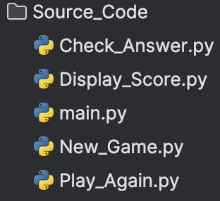

# Python_App_Dockerized
## Strucutre Of Project
There are 2 folders for the progect:
- **Source_Code**: this folder contain the main code of the project; written in Python.
- **Dockerfile**: this file is the <ins>Dockefile</ins> used to build the Image that will be used to create a new Container istance.

### Source Code
The structure of this directory is composed with the <ins>MAIN</ins> python file the is a simple call toother funtion nested in the same directory.

