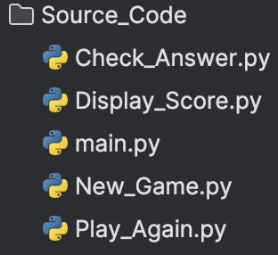

# Python Application Using <ins>**Docker**</ins> Container
## Table Of Content
* [Description](#description) 
* [Main Application](#main_application) 
  - [Main.py](#main.py) 
  - [New_Game.py](#new_game.py) 
  - [Display_Score.py](#display_score.py) 
  - [Check_Answer.py](#check_answer.py) 
  - [Play_Again.py](#play_again.py)
* [Dockerfile](#dockerfile) 
---
 
## Description
This application is build as an example of using the [Docker](https://www.docker.com) technology to containeraize the application innit.

## Main Applicationt
There are 2 folders for the progect:
- **Source_Code**: this folder contain the main code of the project; written in Python.
- **Dockerfile**: this file is the <ins>Dockefile</ins> used to build the Image that will be used to create a new Container istance.

### Source Code
The structure of this directory is composed with the <ins>MAIN</ins> python file the is a simple call toother funtion nested in the same directory.
 
As show below:

## MAIN:py
 

<ol>
  <li>
    <a href="#link_to_heading">
      Chapter or subsection title
       
      Page 1
    </a>

    <ol role="list">
      <!-- subsection items -->
    </ol>
  </li>
</ol>
